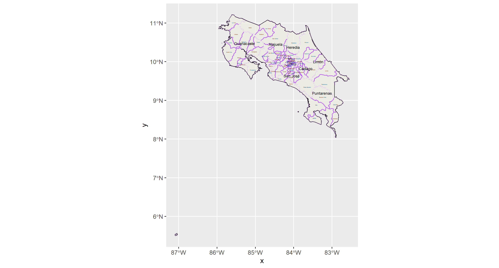
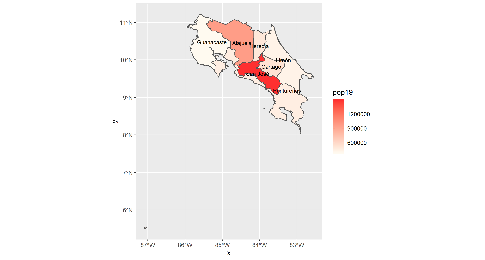
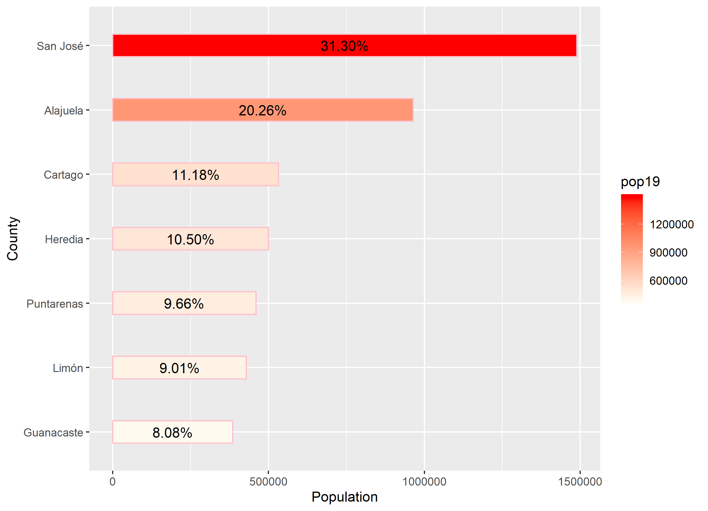
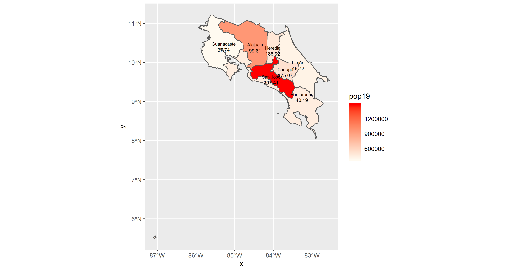
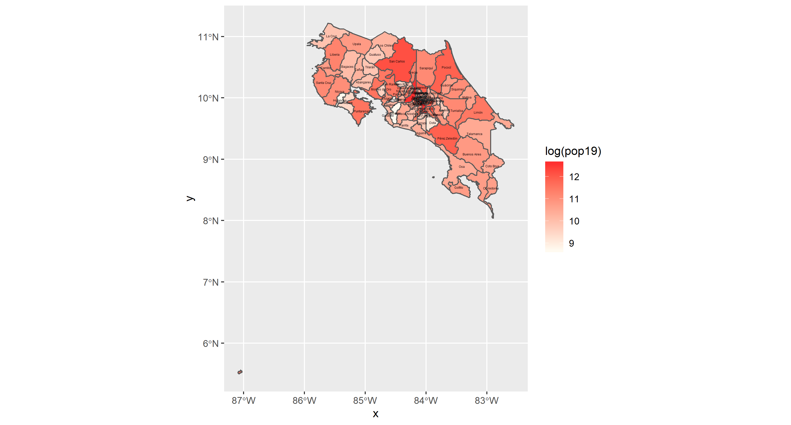
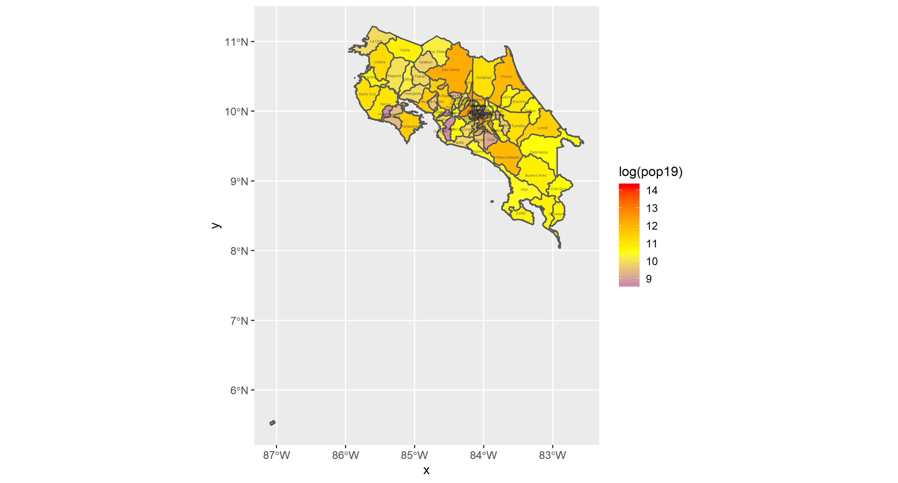
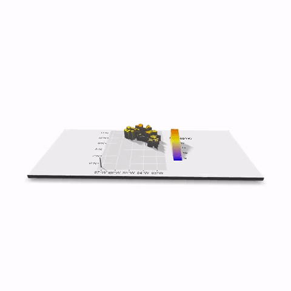

# Project 1: Costa Rica
Alyssa Nekritz

## Administrative Subdivisions of Costa Rica
The following image is the original outline for the subdivisions in Costa Rica. It was challenging to get the words to stop overlapping, but there are too many different label areas. I had trouble getting the layers correct as well. If the picture id downloaded however, you can zoom in and get a clearer view of the labelling.

## Population of Costa Rica's Counties

## Population of Costa Rica's Districts

## Costa Rica's population distribution over a geometric bar

## Population Density on Costa Rica's each province

## Stretch Goals

1. Costa Rica's Districts described in terms of Log of Population

2. Costa Rica's Districts (Log of Populaiton) x-axis = longitude, y-axis = latitude

3. Costa Rica 3-D Imagery

